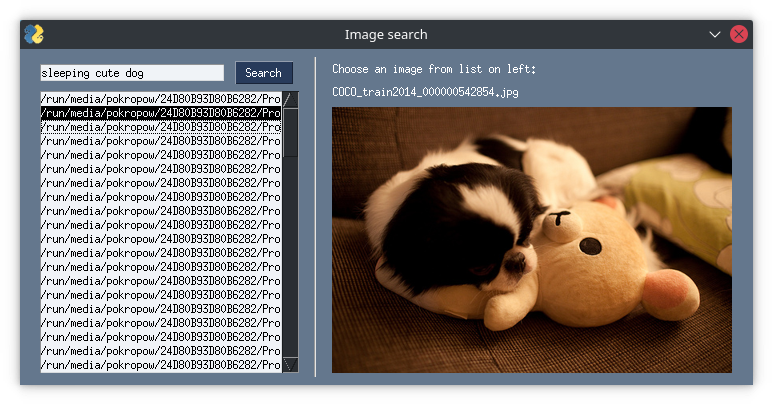

# CLIP-image-search
Application to search images by their content specified by text query.

## Usage

First user has to generate index of images to search from:

```
$ python3 index.py <directory with images>
```

This will generate index.pickle file.

To search images search.py script is used:

```
$ python3 search.py
```


